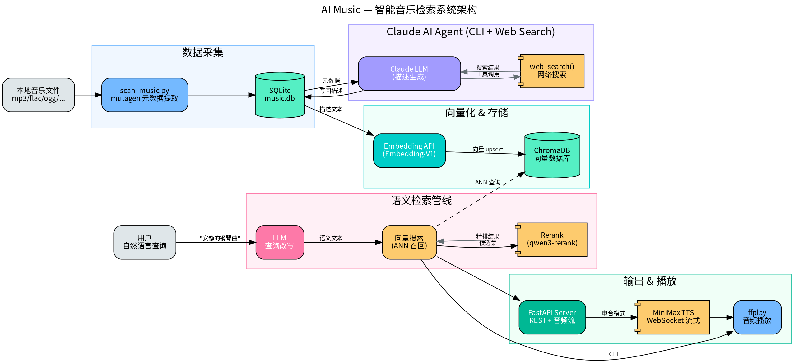

# AI Music — 基于语义理解的智能音乐检索与播放系统

## 项目简介

AI Music 是一套完整的本地音乐智能管理系统。系统扫描本地音乐库后，利用 **AI Agent 自动生成曲目语义描述**，经 Embedding 向量化后存入向量数据库，实现**自然语言驱动的语义检索与播放**。用户只需用自然语言描述想听的音乐风格、情绪或场景（如"深夜一个人想听点忧伤的"），系统即可精准匹配并播放。

## 核心亮点

- **AI Agent 驱动的语义标注**：调用 Claude CLI（带 Web Search 工具）作为 Agent，自动为每首曲目生成包含作曲家、流派、情绪、氛围、比喻场景的中文语义描述，替代传统标签体系
- **两阶段检索管线**：向量召回（ANN）+ Rerank 精排，先用 ChromaDB 宽泛召回 3x 候选，再用 qwen3-rerank 语义精排，兼顾召回率与准确率
- **LLM 查询改写**：用户自然语言输入经 LLM 改写为富含语义特征的搜索文本，提升检索匹配质量
- **多模态输出**：集成 TTS（WebSocket 流式语音合成），支持电台模式——AI 生成播报文案并语音朗读后播放曲目
- **场景化扩展**：EPUB 阅读器 API 可根据当前阅读内容自动匹配背景音乐

## 系统架构



系统分为五层，数据从左至右流动：

| 层级 | 职责 | 关键技术 |
|------|------|----------|
| **数据采集** | 扫描本地音乐文件，提取元数据 | mutagen, SQLite |
| **AI 语义描述** | Agent 自动生成曲目语义描述 | Claude CLI + Web Search Tool, 多线程并行 |
| **向量化 & 存储** | 描述文本转向量并持久化 | Embedding API, ChromaDB |
| **查询 & 交互** | 自然语言查询 → 语义搜索 | LLM 查询改写, 向量检索 + Rerank |
| **输出 & 播放** | 搜索结果播放、电台播报 | TTS (WebSocket), FastAPI, ffplay |

## 搜索管线详解


搜索管线是系统的核心，分为四个阶段：

1. **LLM 语义改写**：用户自由输入 → Claude 提取情绪/氛围/风格特征 → 生成富含语义的搜索文本（含比喻和场景描写）
2. **文本向量化**：搜索文本通过 Embedding API 转为 1536 维向量
3. **向量召回**：ChromaDB ANN 查询，广泛召回 Top-N×3 候选集
4. **Rerank 精排**：qwen3-rerank 根据语义相关性对候选集重排序，输出最终 Top-N 结果

## 技术栈

| 类别 | 技术 |
|------|------|
| **AI / LLM** | Claude CLI (Agent + Web Search Tool), Anthropic API, Embedding-V1, qwen3-rerank |
| **向量数据库** | ChromaDB (持久化存储, ANN 查询) |
| **关系数据库** | SQLite (元数据存储) |
| **TTS** | MiniMax WebSocket 流式语音合成 |
| **Web 服务** | FastAPI + Uvicorn (REST API, 音频流, CORS) |
| **音频处理** | mutagen (元数据提取), ffplay/mpv (播放) |
| **语言** | Python 3 |

## AI Agent 设计

系统中曲目描述的生成采用了 **Agent 架构**：

```
gen_text.py  →  Claude CLI  →  [Web Search Tool]  →  结构化描述输出
   │                │                                      │
   │          自动调用搜索工具                          150-200字中文描述
   │          获取曲目准确信息                       (作曲家/时期/情绪/比喻/场景)
   │
   └── ThreadPoolExecutor (5x 并行) ──→ 批量处理 + 自动 Embedding 入库
```

- Agent 通过 `--allowedTools mcp__MiniMax__web_search` 获得网络搜索能力，确保生成描述的准确性
- 5 个工作线程并行处理，批量 Embedding 写入（batch size=10），支持大规模音乐库

## 交互方式

### CLI 模式
```bash
python play.py "安静的钢琴曲"       # 自然语言搜索并播放
python play.py "查询" 2            # 播放第2个搜索结果
python play.py "查询" a            # 电台模式：全部播放 + AI 语音播报
```

### Web 模式
```bash
python server.py                   # 启动 FastAPI 服务 (局域网可访问)
# 提供搜索、音频流、TTS、电台播报等 REST API
```

### EPUB 阅读配乐
```bash
python epub_api.py                 # 阅读器发送当前文本 → AI 生成氛围描述 → 自动匹配背景音乐
```

## 项目结构

```
ai-music/
├── music_db.py          # SQLite 数据层 (Track dataclass, CRUD)
├── scan_music.py        # 音乐文件扫描与元数据提取
├── gen_text.py          # AI Agent 并行生成曲目描述
├── embedding.py         # Embedding & Rerank API 客户端
├── embeddingdb.py       # ChromaDB 向量存储与检索 (含两阶段搜索)
├── play.py              # CLI 入口：自然语言查询 + 播放
├── server.py            # FastAPI Web 服务 (搜索/音频流/TTS/电台)
├── epub_api.py          # EPUB 阅读器配乐 API
├── speech.py            # MiniMax TTS (WebSocket 流式)
└── static/              # Web 前端
```
